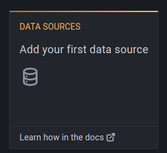

# Execute o projeto

```sh
docker-compose up -d
```

## Grafana

### Acesse o grafana

| URL                         | Username | Password |
|-----------------------------|----------|----------|
| http://localhost:3000/login | admin    | password |

### Adicione o data source

1. Clique para adicionar um data source

    

    **figura 1** adicionar data source

2. Selecione `Prometheus`
3. Em Http -> URL, digite o endereço `http://172.17.0.1:9090`
4. Clique em `Save & test`

### Importe o dashboard via grafana.com

1. Informe o id do dashboard: `11600`
2. Clique em `Load`
3. Na nova tela, selecione `Prometheus`
4. Clique em `Import`
5. Você deve visualizar o consumo de recursos dos containers docker

    

    **figura 2** visualização dos dados no grafana

